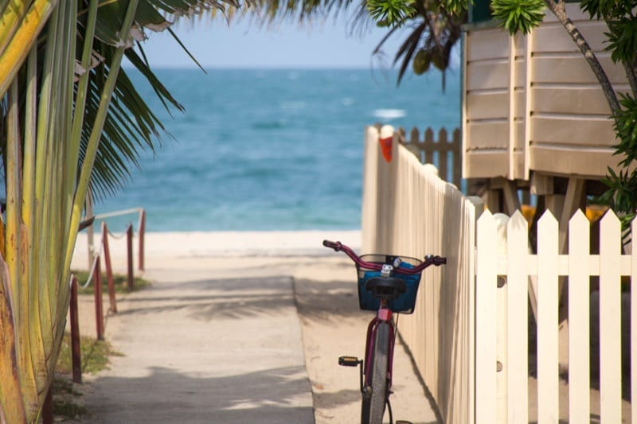
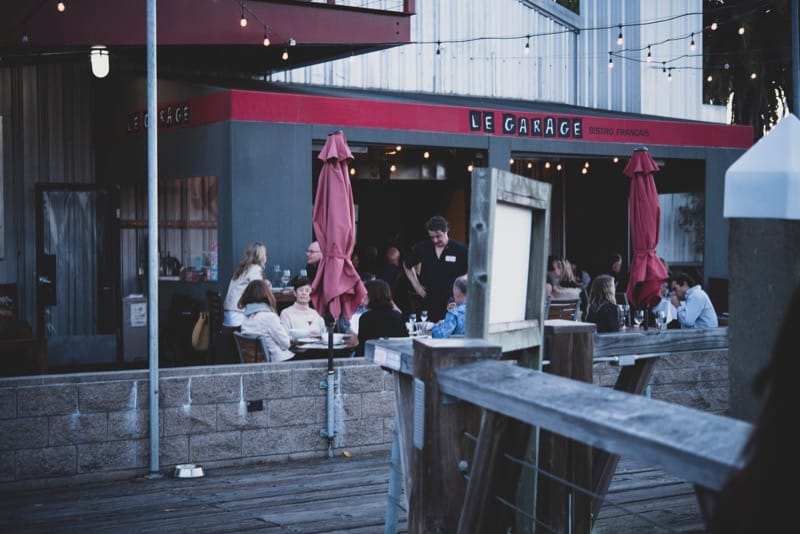
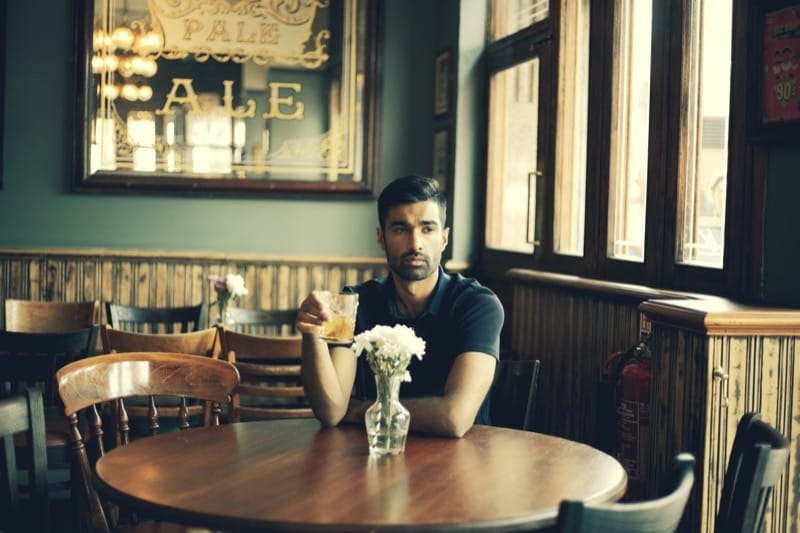

A paragraph looks like this — Globally incubate standards compliant channels before scalable benefits. Quickly disseminate superior deliverables whereas web-enabled applications. Quickly drive clicks-and-mortar catalysts for change before vertical architectures. Credibly reintermediate backend ideas for cross-platform models. Continually reintermediate integrated processes through technically sound intellectual capital. Holistically foster superior methodologies.

***

## Headings by default:

# H1 Default styles for headings
## H2 Default styles for headings
### H3 Default styles for headings
#### H4 Default styles for headings
##### H5 Default styles for headings
###### H6 Default styles for headings

***

## Lists

### Ordered list example:

1. Poutine drinking vinegar bitters.
2. Coloring book distillery fanny pack.
3. Venmo biodiesel gentrify enamel pin meditation.
4. Jean shorts shaman listicle pickled portland.
5. Salvia mumblecore brunch iPhone migas.

***

### Unordered list example:

* Bitters semiotics vice thundercats synth.
* Literally cred narwhal bitters wayfarers.
* Kale chips chartreuse paleo tbh street art marfa.
* Mlkshk polaroid sriracha brooklyn.
* Pug you probably haven't heard of them air plant man bun.

***

## Table

<div class="table-container">
  <table>
    <tr><th>Header 1</th><th>Header 2</th><th>Header 3</th><th>Header 4</th><th>Header 5</th></tr>
    <tr><td>Row:1 Cell:1</td><td>Row:1 Cell:2</td><td>Row:1 Cell:3</td><td>Row:1 Cell:4</td><td>Row:1 Cell:5</td></tr>
    <tr><td>Row:2 Cell:1</td><td>Row:2 Cell:2</td><td>Row:2 Cell:3</td><td>Row:2 Cell:4</td><td>Row:2 Cell:5</td></tr>
    <tr><td>Row:3 Cell:1</td><td>Row:3 Cell:2</td><td>Row:3 Cell:3</td><td>Row:3 Cell:4</td><td>Row:3 Cell:5</td></tr>
    <tr><td>Row:4 Cell:1</td><td>Row:4 Cell:2</td><td>Row:4 Cell:3</td><td>Row:4 Cell:4</td><td>Row:4 Cell:5</td></tr>
    <tr><td>Row:5 Cell:1</td><td>Row:5 Cell:2</td><td>Row:5 Cell:3</td><td>Row:5 Cell:4</td><td>Row:5 Cell:5</td></tr>
    <tr><td>Row:6 Cell:1</td><td>Row:6 Cell:2</td><td>Row:6 Cell:3</td><td>Row:6 Cell:4</td><td>Row:6 Cell:5</td></tr>
  </table>
</div>

***

## Quotes

#### A quote looks like this:

> The longer I live, the more I realize that I am never wrong about anything, and that all the pains I have so humbly taken to verify my notions have only wasted my time!
>
> <cite>George Bernard Shaw</cite>

***

## Callouts

:::note
  Useful information that users should know, even when skimming content.
:::

:::tip
  Helpful advice for doing things better or more easily.
:::

:::important
  Key information users need to know to achieve their goal.
:::

:::warning
  Urgent info that needs immediate user attention to avoid problems.
:::

:::caution
  Advises about risks or negative outcomes of certain actions.
:::

> [!note] You can add custom title
> And use Github style!

```markdown
:::note
  Useful information that users should know, even when skimming content.
:::
```

```markdown
:::tip
  Helpful advice for doing things better or more easily.
:::
```

```markdown
:::important
  Key information users need to know to achieve their goal.
:::
```

```markdown
:::warning
  Urgent info that needs immediate user attention to avoid problems.
:::
```

```markdown
:::caution
  Advises about risks or negative outcomes of certain actions.
:::
```

```markdown
> [!tip] You can add custom title
> And use Github style!
```

***

## Syntax Highlighter

```css
body {
  margin: 0;
  display: flex;
  justify-content: center;
  align-items: center;
  height: 100vh;
  width: 100vw;
  background-color: #1c2021;
}

li {
  width: 200px;
  min-height: 250px;
  border: 1px solid #000;
  display: inline-block;
  vertical-align: top;
  margin: 5px;
}
```

```js
  $('.top').click(function () {
    $('html, body').stop().animate({ scrollTop: 0 }, 'slow', 'swing');
  });
  $(window).scroll(function () {
    if ($(this).scrollTop() > $(window).height()) {
      $('.top').addClass("top-active");
    } else {
      $('.top').removeClass("top-active");
    };
  });
```

***

## Images

:::wide

*Photo by [Luke McKeown](https://unsplash.com/photos/nlyWZtWTzCo) on [Unsplash](https://unsplash.com/)*
:::

:::gallery
  
  
  
  
  
  
  
  
  
   *Gallery / [Unsplash](https://unsplash.com/)*
:::


*Photo by [Sean Kelley](https://unsplash.com/photos/aQ5MBh_mfcc) on [Unsplash](https://unsplash.com/)*

***

## Youtube Embed

<p><iframe src="https://www.youtube.com/embed/gghgYaYeG_M" loading="lazy" frameborder="0" allowfullscreen></iframe></p>

***

## Vimeo Embed

<p><iframe src="https://player.vimeo.com/video/107654760" width="640" height="360" frameborder="0" allowfullscreen></iframe></p>

***